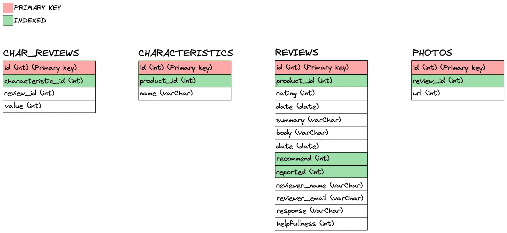
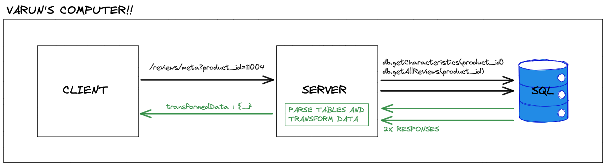

# Reviews-API
A REST API micro-service which provides an API to the Atelier e-Commerce application. The service queries an SQL database. The database and the server have been optimized to look-thourgh 20mil+ items of data and  transform it in a way in which it is digestable for a front-end application that has already been designed and built.

This service makes use of caching by implementing Redis. The caching takes into account data-integrity and only caches when it is possible to sacrifice speed for integrity.

# Schema




# Data Flow
## Local


The system itself would not be accessed off of any local computer but prior to hosting, that is how the system was originally implemented.

Queries executed by the meta reviews endpoint:

```
db.getAllReviews(product_id) =
SELECT rating, recommend FROM
reviews WHERE product_id=${id} AND
reported=1 ORDER BY id DESC

db.getCharacteristics(product_id) =
SELECT characteristics.id, product_id,
name, value FROM characteristics LEFT JOIN
characteristics_reviews ON characteristics.id =
characteristics_reviews.characteristic_id
WHERE product_id=${id}
```

Tested the meta reviews endpoint using artillery.io. The tests showed that locally the server and database can easily handel 1000 users per second.

```
meta reviews endpoint =
Summary report @ 22:29:54(-0400) 2021-06-29
  Scenarios launched:  1000
  Scenarios completed: 1000
  Requests completed:  1000
  Response time (msec):
    min: 1
    max: 136
    median: 3
    p95: 113
    p99: 123
  Scenario counts:
    0: 1000 (100%)
  Codes:
    200: 1000
```

## Deployed


# Endpoints
### GET /reviews
Retrieves a list of reviews for the specified product.

Parameter | Type | Description
-------|------|------------
page | integer | Selects the page of results to return. Default 1.
count | integer | Specifies how many results per page to return. Default 5.
sort | 	text | Changes the sort order of reviews to be based on "newest", "helpful", or "relevant".
product_id | 	integer | Specifies the product for which to retrieve reviews.


RESPONSE
> Response: Status 200 OK
```json
{
    "product": "11005",
    "page": 0,
    "count": "100",
    "results": [
        {
            "review_id": 63948,
            "rating": 1,
            "summary": "Similique in itaque et id nostrum soluta.",
            "recommend": 1,
            "response": null,
            "body": "Qui quia vel voluptatum. Accusantium porro mollitia
            enim rerum expedita fugit aspernatur.
            Ex illum architecto nihil nulla. Vel voluptatem velit.
            Quam sint ipsum nemo repellat architecto non natus ut delectus.
            Voluptate dicta natus qui provident molestias.",
            "date": "2021-06-24T04:00:00.000Z",
            "reviewer_name": "Winfield_Schowalter",
            "helpfulness": 1,
            "photos": [
                "https://images.unsplash.com/photo-1465877783223-
                4eba513e27c6?ixlib=rb-1.2.1&ixid=eyJhcHBfaWQiOjEyMDd9&auto=
                format&fit=crop&w=1650&q=80"
            ]
        },
        {
            "review_id": 63947,
            "rating": 1,
            "summary": "Accusantium id possimus voluptas.",
            "recommend": 1,
            "response": null,
            "body": "Qui placeat et. Omnis incidunt sed non ex rerum quo aut. Quam magni commodi.",
            "date": "2021-06-24T04:00:00.000Z",
            "reviewer_name": "Lauretta_Abshire",
            "helpfulness": 6,
            "photos": []
        },
        ...
    ]
}
```

### GET /reviews/meta
Retrieves meta data for a product.

Parameter | Type | Description
-------|------|------------
page | integer | Selects the page of results to return. Default 1.

RESPONSE
> Response: Status 200 OK
```json
{
    "product_id": "11004",
    "ratings": {
        "2": 1,
        "3": 1,
        "4": 14
    },
    "recommended": {
        "0": 11,
        "1": 5
    },
    "Fit": {
        "id": 36720,
        "value": 2.3
    },
    "Length": {
        "id": 36721,
        "value": 2.7
    },
    "Comfort": {
        "id": 36722,
        "value": 4.4
    },
    "Quality": {
        "id": 36723,
        "value": 3.8
    }
}
```

### POST /reviews
Add's a review to the list of reviews.

Parameter | Type | Description
-------|------|------------
product_id | integer | Required ID of the product to post the review for
rating | integer | Integer (1-5) indicating the review rating
summary | text | Summary text of the review
body | text | Continued or full text of the review
recommend | bool | Value indicating if the reviewer recommends the product
name | text | Username for question asker
email | text | Email address for question asker
photos | [text] | Array of text urls that link to images to be shown
characteristics | object | Object of keys representing characteristic_id and values representing the review value for that characteristic. { "14": 5, "15": 5 //...}

RESPONSE
> Response: Status 201 CREATED

### PUT /reviews/:review_id/helpful
Updates a review and adds to the helpful counter

Parameter | Type | Description
-------|------|------------
reveiw_id | integer | Required ID of the review to update

RESPONSE
> Response: Status 204 NO CONTENT

### PUT /reviews/:review_id/report
Reports a review so that the next time get is called on the product, the review will not show up.

Parameter | Type | Description
-------|------|------------
reveiw_id | integer | Required ID of the review to update

RESPONSE
> Response: Status 204 NO CONTENT